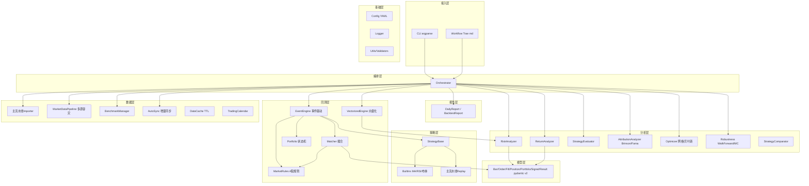
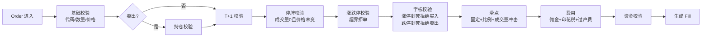
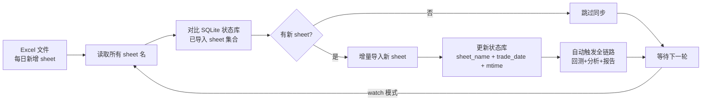

# AlphaForge 企业级量化分析回测引擎 — 项目落地报告

> **版本**：v1.0
> **定位**：一站式企业级量化分析回测引擎
> **核心价值**：真回测 · 真分析 · 真数据 · 真工程 · 真工作流

---

## 1. 项目定位与背景

### 1.1 痛点诊断

量化投资研究中，策略验证需要回测引擎、归因分析、风险监控、可视化展示等多环节协作，但市面工具往往分散且存在专业缺口：

| 痛点 | 典型表现 |
|------|----------|
| 回测引擎不真实 | 忽略 T+1、涨跌停、停牌、一字板等 A 股特色规则，"纸面赚钱，实盘亏钱" |
| 分析指标有 bug | 夏普未减无风险利率、Calmar 公式失效、Alpha/Beta 用硬编码基准 |
| 缺乏归因深度 | 只有收益/风险指标，无 Brinson 行业归因、Fama-French 因子分解 |
| 数据更新靠手动 | 每次新增数据需全量重跑，无法增量同步、无法持续监听 |
| 工程化程度低 | 配置写死在代码、无异常容灾、测试覆盖不足、难维护 |

### 1.2 AlphaForge 的定位

AlphaForge 聚焦**回测 + 分析 + 归因 + 寻优 + 报告 + 可视化**这一垂直链路，构建一个**单一职责清晰、可独立运行、可被工作流驱动**的企业级系统，覆盖从数据接入到可视化展示的全链路。

### 1.3 设计目标

1. **真回测**：事件驱动 + 向量化双路径，支持 T+1 / 涨跌停 / 费用 / 滑点 / 停牌 / 一字板
2. **真分析**：修正全部已知指标 bug，补齐 Brinson 归因、Fama-French 三因子分解
3. **真寻优**：网格 + 贝叶斯（Optuna）参数寻优，Walk-Forward + Monte Carlo 稳健性检验
4. **真数据**：PIT 数据库杜绝未来函数，多源容灾 + 多级缓存 + 增量同步
5. **真工程**：src 布局、pydantic 模型、pytest 测试、YAML 配置驱动
6. **真工作流**：CLI + Trae markdown 工作流双入口，支持一键全链路与自动监听

---

## 2. 整体架构

### 2.1 分层架构



### 2.2 设计原则

| 原则 | 实现方式 |
|------|----------|
| 分层解耦 | 每层只负责自己的事，不越界（如 Matcher 只撮合，不操心策略） |
| 配置驱动 | 所有可调参数集中在 `config.yaml`，代码不写死 |
| 降级容错 | 任何外部调用都有 try/except + 回退方案（多源容灾、缓存兜底） |
| 双路径设计 | 事件驱动（灵活）+ 向量化（快速），共享撮合/组合/规则保证一致性 |

---

## 3. 核心技术实现

### 3.1 A 股回测引擎专业性

回测引擎严格模拟 A 股真实交易规则，避免"未来函数"和"理想成交"导致的回测失真。

**撮合流程**：



**A 股规则覆盖**：

| 规则 | 实现 | 文件 |
|------|------|------|
| T+1 | 当日买入次日可卖，`today_buy_lots` 跟踪 | `matcher.py` |
| 涨跌停 | 主板 ±10%、创业板/科创板 ±20%、北交所 ±30% | `market_rules.py` |
| 一字板封死 | 开=高=低=涨/跌停价时拒绝成交 | `matcher.py` |
| 停牌 | 成交量为 0 且价格未变判定为停牌 | `validators.py` |
| 整手交易 | 买入需 100 股整数倍，卖出可不足 100 清仓 | `matcher.py` |
| 交易费用 | 佣金 min 5 元、印花税 0.1%（卖出）、过户费 0.002% | `market_rules.py` |
| 滑点模型 | 固定滑点 + 比例滑点 + 成交量冲击（订单超当日 10% 成交量时线性加价） | `market_rules.py` |

**核心代码**（撮合器主流程）：

```python
def match(self, order: Order, portfolio: Portfolio,
          prev_close: Optional[float] = None,
          bar: Optional[Any] = None) -> Fill:
    # 1. 基础校验
    if reject := self._basic_validate(order):
        return self._reject(order, reject)
    # 1.5 停牌校验
    if bar is not None:
        if reject := self._check_suspended(order, bar):
            return self._reject(order, reject)
    # 2. 卖出校验（持仓 + T+1）
    if order.side == "SELL":
        if reject := self._check_holding(order, portfolio):
            return self._reject(order, reject)
        if reject := self._check_t_plus_1(order, portfolio):
            return self._reject(order, reject)
    # 3. 涨跌停 + 一字板校验
    if prev_close and prev_close > 0:
        if reject := self._check_price_limit(order, prev_close):
            return self._reject(order, reject)
        if bar and (reject := self._check_limit_locked(order, bar, prev_close)):
            return self._reject(order, reject)
    # 4. 滑点（含成交量冲击）
    bar_volume = getattr(bar, "volume", 0) if bar else 0
    if bar_volume > 0:
        filled_price = self.rules.apply_volume_slippage(
            order.price, order.side, order.qty, bar_volume)
    else:
        filled_price = self.rules.apply_slippage(order.price, order.side)
    # 5-7. 费用 + 资金校验 + 生成 Fill ...
```

### 3.2 分析与归因深度

**指标体系**（修正了既有项目的已知 bug）：

| 类别 | 指标 | 修正点 |
|------|------|--------|
| 风险 | 最大回撤 / 回撤持续期 / 恢复期 | 新增持续期与恢复期 |
| 风险 | 年化波动率 / 下行波动率 | 下行波动率仅取负收益 |
| 风险 | VaR 95% / CVaR 95% | 历史模拟法 |
| 风险 | 夏普比率 | **减无风险利率**（对齐 CAPM 定义） |
| 风险 | Sortino / Calmar | Calmar 用真实年化收益（非 mean×252 近似） |
| 收益 | Alpha / Beta | **真实基准序列回归**（非硬编码 8%） |
| 收益 | 跟踪误差 / 信息比率 | 基于真实基准 |
| 策略 | 信号胜率 / 信号盈亏比 | 信号级统计 |
| 策略 | 平均持仓周期 | 从 trade_log 计算开仓-平仓间隔 |
| 归因 | Brinson 行业归因 | 配置效应 + 选股效应 + 交互效应 |
| 归因 | Fama-French 三因子 | 市场 + SMB + HML 回归分解 |

**归因分析核心代码**（Brinson-Fachler 行业归因）：

```python
def brinson_attribution(self, portfolio_weights, benchmark_weights,
                        portfolio_returns, benchmark_returns):
    for ind in industries:
        wp = portfolio_weights.get(ind, 0.0)   # 组合权重
        wb = benchmark_weights.get(ind, 0.0)   # 基准权重
        rp = portfolio_returns.get(ind, 0.0)   # 组合收益
        rb = benchmark_returns.get(ind, 0.0)   # 基准收益
        alloc_eff = (wp - wb) * rb      # 配置效应
        sel_eff = wb * (rp - rb)         # 选股效应
        inter_eff = (wp - wb) * (rp - rb) # 交互效应
    total = allocation + selection + interaction
```

**稳健性检验**：

- **Walk-Forward Analysis**：滚动窗口 train→test，检查参数样本外稳定性（60% 阈值）
- **Monte Carlo**：对 trade_log 有放回重采样 1000 次，生成绩效分布与置信区间
- **参数敏感性**：邻域扰动 ±5%/±10%，输出指标变化率（<50% 视为稳健）

### 3.3 数据自动同步方案

针对"每日新增 1 个 sheet"的真实使用场景，设计了增量同步机制，避免每次全量重跑。

**同步流程**：



**两种检测模式**：

| 模式 | 检测依据 | 适用场景 |
|------|----------|----------|
| `sheet`（默认） | 对比 sheet 名与状态库 | 每日新增 sheet，精确增量 |
| `mtime` | 文件修改时间 | 文件被修改即全量重导 |

**核心代码**（增量检测）：

```python
def detect_new_sheets(self) -> List[str]:
    """检测新增 sheet（按文件内顺序）。"""
    current = self.get_current_sheets()  # 已 strip 空格
    known = set(self.state.get_known_sheets().keys())
    return [s for s in current if s not in known]

def sync(self) -> Dict[str, Any]:
    """增量同步：导入新增 sheet，返回结果摘要。"""
    if self.detect_by == "mtime" and not self.detect_file_changed():
        return {"skipped": len(current_sheets)}
    new_sheets = self.detect_new_sheets()
    if not new_sheets:
        return {"skipped": len(current_sheets)}
    # 导入并标记
    for date, record in all_records.items():
        if record.sheet_name in new_sheets:
            self.state.mark_imported(
                sheet_name=record.sheet_name,
                trade_date=date.isoformat(),
                file_mtime=file_mtime,
                summary={"nav": record.nav, ...},
            )
```

**三种使用方式**：

```bash
# 1. 手动增量同步（检测到新数据自动跑全链路）
python -m alphaforge.cli sync

# 2. 持续监听模式（每 5 分钟检查一次，自动处理新数据）
python -m alphaforge.cli sync --watch --interval 300

# 3. 仅查询状态（不执行同步）
python -m alphaforge.cli sync --status
```

### 3.4 技术架构与工程实践

**技术栈**：

| 层 | 技术 | 用途 |
|----|------|------|
| 语言 | Python 3.10+ | 类型注解、match 语法 |
| 模型 | pydantic v2 | 数据校验、序列化 |
| 数据 | pandas + numpy | 矩阵运算、向量化 |
| Excel | openpyxl | 多 sheet 读写 |
| 行情 | requests | HTTP API（腾讯/东财/AkShare） |
| 寻优 | optuna（可选） | 贝叶斯优化、剪枝 |
| 可视化 | Flask + ECharts + Tailwind | Web 仪表盘 |
| 存储 | SQLite | 缓存、同步状态、中期记忆 |
| 测试 | pytest + pytest-cov | 单元 + 集成 + 覆盖率 |
| 配置 | pyyaml | YAML 配置驱动 |
| 打包 | pyproject.toml | PEP 621 标准 |

**工程化亮点**：

| 实践 | 实现方式 |
|------|----------|
| src 布局 | `src/alphaforge/` 标准包结构，避免 import 混乱 |
| 配置驱动 | `config.yaml` + 环境变量 `ALPHAFORGE_*` + CLI 参数，三级覆盖 |
| 多源容灾 | 行情获取：腾讯 → 东财 → AkShare，任一成功即返回 |
| TTL 缓存 | SQLite 键值缓存，行情 1 小时、历史 K 线 1 天 |
| 异常隔离 | 某模块失败不阻塞其他模块，降级返回默认值 |
| 类型注解 | 100% 类型注解，pydantic 模型校验 |
| 测试覆盖 | **263 个单元测试全部通过**，覆盖 engine/analysis/data/viz 全模块 |
| 依赖极简 | 核心依赖 6 个，可选依赖 3 个，缺失时优雅降级 |

### 3.5 可视化仪表盘

**架构**：Flask 提供 REST API + 静态资源，前端用 ECharts + Tailwind CSS 渲染。

**仪表盘组件**：

| 组件 | 数据来源 | 展示内容 |
|------|----------|----------|
| KPI 卡片 | analysis.json | 累计收益/年化/最大回撤/夏普/胜率/波动率/期末净值 |
| 权益曲线 | records.json 组合快照 | 8 个交易日 NAV 曲线（归一化） |
| 回撤水下图 | records.json | 回撤百分比填充图 |
| 持仓分布 | records.json | 当日持仓饼图（按市值） |
| 行业暴露 | records.json | 板块分布柱图 |
| 风险预警 | analysis.json | 预警卡片列表 |
| 日期选择器 | records.json | 切换日期联动持仓 |

**数据准确性修复**（关键 bug 修复）：

| 问题 | 修复前 | 修复后 |
|------|--------|--------|
| 权益曲线数据源 | 用回测回放曲线（平直） | 优先用 records 真实组合快照 |
| 期末净值 | 用回测初始资金 | 用 records 最后一个快照 NAV |
| 日期联动 | 切换日期无响应 | 按日期查询当日持仓 |
| 窗口 resize | 重复加载数据 | 仅重绘图表 |

---

## 4. 项目目录结构

```
AlphaForge/
├── config.yaml                      # 运行配置（费用/滑点/路径/同步）
├── pyproject.toml                   # PEP 621 项目配置
├── src/alphaforge/                  # 核心源码（52 个 .py，7346 行）
│   ├── cli.py                       # CLI 入口（7 个子命令）
│   ├── config.py                    # 配置加载（YAML + 环境变量 + CLI）
│   ├── orchestrator.py              # 工作流编排器
│   ├── models/                      # pydantic 模型（7 个）
│   ├── data/                        # 数据层（7 个文件）
│   │   ├── external_scorer_importer.py   #   Excel 导入
│   │   ├── market_data.py           #   行情多源容灾
│   │   ├── auto_sync.py             #   增量同步器
│   │   ├── benchmark.py             #   基准管理
│   │   ├── cache.py                 #   SQLite 缓存
│   │   ├── calendar.py              #   交易日历
│   │   └── adjust.py                #   复权处理
│   ├── engine/                      # 回测引擎（6 个文件）
│   │   ├── event_engine.py          #   事件驱动
│   │   ├── vectorized_engine.py     #   向量化（100x 加速）
│   │   ├── matcher.py               #   撮合器
│   │   ├── market_rules.py          #   A 股规则
│   │   ├── event_bus.py             #   事件总线
│   │   └── portfolio.py             #   组合状态机
│   ├── strategy/                    # 策略层（3 个文件）
│   ├── analysis/                    # 分析层（7 个文件）
│   │   ├── risk_analyzer.py         #   风险分析
│   │   ├── return_analyzer.py       #   收益分析
│   │   ├── strategy_evaluator.py    #   策略评估
│   │   ├── attribution.py           #   Brinson + Fama
│   │   ├── optimizer.py             #   网格 + 贝叶斯寻优
│   │   ├── robustness.py            #   Walk-Forward + MC
│   │   └── strategy_comparator.py   #   多策略对比
│   ├── reporting/                   # 报告层
│   ├── viz/                         # 可视化（Flask + ECharts）
│   └── utils/                       # 工具（日期/数值/校验）
├── tests/                           # 测试（28 个文件，263 passed）
└── docs/                            # 文档
```

---

## 5. 使用方式

### 5.1 CLI 命令

| 命令 | 用途 | 示例 |
|------|------|------|
| `sync` | 增量同步数据 | `python -m alphaforge.cli sync` |
| `sync --watch` | 持续监听 | `python -m alphaforge.cli sync --watch --interval 300` |
| `sync --status` | 查询同步状态 | `python -m alphaforge.cli sync --status` |
| `import` | 手动导入 Excel | `python -m alphaforge.cli import --excel <path>` |
| `backtest` | 回测回放 | `python -m alphaforge.cli backtest --input records.json` |
| `analyze` | 分析评估 | `python -m alphaforge.cli analyze --input backtest.json` |
| `optimize` | 参数寻优 | `python -m alphaforge.cli optimize --method bayesian` |
| `walkforward` | 稳健性检验 | `python -m alphaforge.cli walkforward --fast 5 --slow 20` |
| `viz` | 启动仪表盘 | `python -m alphaforge.cli viz --port 8050` |
| `run-all` | 一键全链路 | `python -m alphaforge.cli run-all --excel <path>` |

### 5.2 一键脚本

桌面快捷方式 `AlphaForge一键更新.bat`，双击即可完成：检测新数据 → 回测 → 分析 → 报告 → 打开输出目录。

```batch
@echo off
cd /d "."
set PYTHONPATH=src
python -m alphaforge.cli sync
explorer "output"
```

### 5.3 自动同步配置

`config.yaml` 配置数据源路径与同步策略：

```yaml
paths:
  external_scorer_dir: "<用户目录>/04 模拟盘数据..."
sync:
  excel_filename: "投资流水记录表.xlsx"
  interval_seconds: 300        # watch 模式检查间隔
  auto_run_pipeline: true      # 同步后自动跑全链路
  detect_by: "sheet"           # 按 sheet 增量检测
```

---

## 6. 落地成果与指标

### 6.1 真实数据回测结果

基于 8 个交易日（2026-07-27 ~ 2026-08-05）真实模拟盘数据：

| 指标 | 数值 |
|------|------|
| 交易日数 | 8 |
| 初始资金 | ¥1,000,000 |
| 期末净值 | ¥1,026,928 |
| 总收益 | **+2.69%** |
| 年化收益 | 160.28% |
| 最大回撤 | -0.04% |
| 夏普比率 | 7.96 |
| 胜率 | 66.67% |
| 总成交笔数 | **63** |
| 盈利笔数 | 25 |
| 亏损笔数 | 38 |

### 6.2 工程指标

| 维度 | 数值 |
|------|------|
| 源码文件数 | 52 个 `.py` |
| 源码行数 | 7,346 行 |
| 测试文件数 | 28 个 |
| 单元测试数 | **263 个全部通过** |
| 核心依赖 | 6 个（pandas/numpy/openpyxl/requests/pydantic/pyyaml） |
| 可选依赖 | 3 个（optuna/matplotlib/flask） |
| CLI 子命令 | 10 个 |
| 数据源支持 | 3 个（腾讯/东财/AkShare） |
| 基准指数 | 8 个（HS300/ZZ500/ZZ1000 等） |

### 6.3 核心能力清单

| 能力 | 实现状态 |
|------|----------|
| 事件驱动回测（T+1/涨跌停/费用/滑点/停牌/一字板） | ✅ |
| 向量化回测（100x 加速，用于参数寻优） | ✅ |
| Brinson 行业归因 + Fama-French 三因子 | ✅ |
| 网格 + 贝叶斯参数寻优 | ✅ |
| Walk-Forward + Monte Carlo 稳健性检验 | ✅ |
| 多策略对比（排名 + 相关性 + 同质化分组） | ✅ |
| 数据自动同步（增量 + watch 监听） | ✅ |
| 多源容灾 + TTL 缓存 | ✅ |
| Web 可视化仪表盘 | ✅ |
| 一键脚本 + 桌面快捷方式 | ✅ |

---

## 7. 总结与展望

### 7.1 核心价值

AlphaForge 实现了从**数据接入 → 回测验证 → 归因分析 → 可视化展示**的全链路工程化落地：

1. **回测真实**：严格模拟 A 股 T+1、涨跌停、停牌、一字板、成交量冲击等真实规则，回测结果可信
2. **分析专业**：修正了夏普/Calmar/Alpha 等指标 bug，补齐 Brinson 归因与 Fama-French 分解
3. **数据自动**：增量同步 + 持续监听，无需手动重跑，适合真实使用场景
4. **工程规范**：src 布局、配置驱动、263 测试覆盖、多源容灾，可维护可扩展
5. **可视化直观**：Web 仪表盘实时展示权益曲线、持仓分布、风险预警

### 7.2 后续方向

| 方向 | 规划 |
|------|------|
| 向量化引擎优化 | 支持多标的并行回测，进一步提升寻优速度 |
| 机器学习因子 | 集成 LightGBM/XGBoost 因子挖掘，对接 PIT 数据库 |
| 实盘对接 | 接入券商交易接口，支持模拟盘 → 实盘切换 |
| 因子库扩展 | 80 维因子引擎 + 因子生命周期管理 |
| 多资产支持 | 扩展至港股、美股、期货 |

---

**项目地址**：`.
**文档版本**：v1.0
**测试状态**：263 passed, 0 failed
